  

  

  
  

---

## 👥 Team JAMstack

  <table style="border: 0px;">
    <tr>
      <td align="center" width="130">
        <a href="https://github.com/kindsmell">
           
          <b>김선향</b> @kindsmell
        </a>
      </td>
      <td align="center" width="130">
        <a href="https://github.com/Happysttim">
           
          <b>노주호</b> @Happysttim
        </a>
      </td>
      <td align="center" width="130">
        <a href="https://github.com/inaemin">
           
          <b>민인애</b> @inaemin
        </a>
      </td>
      <td align="center" width="130">
        <a href="https://github.com/son-hyejun">
           
          <b>손혜준</b> @son-hyejun
        </a>
      </td>
      <td align="center" width="130">
        <a href="https://github.com/lnxhigh">
           
          <b>송상화</b> @lnxhigh
        </a>
      </td>
    </tr>
  </table>

---

## 🌟 Service Introduction

**CodeJam**은 복잡한 설정 없이 클릭 한 번으로 바로 시작할 수 있는 **실시간 협업 코딩 플랫폼**입니다. 
화면 공유의 한계를 넘어, 팀원들과 함께 코드를 직접 수정하고 실시간으로 커서를 따라가며 몰입감 있는 협업 경험을 제공합니다.

### 🚀 Core Values

|           **⚡️ Speed**           |          **🪶 Lightweight**          |          **⏱️ Real-time**          |
| :-------------------------------: | :----------------------------------: | :--------------------------------: |
| 설정 없이 접속 즉시 사용 가능 | 무거운 IDE 대신 필수 기능만 탑재 | 지연 없는 동기화로 원활한 협업 |

---

## ✨ Key Features

### 1️⃣ Zero-Config & Login-Free

- **즉시 시작**: 메인 화면에서 버튼 클릭 한 번으로 고유한 방 URL 자동 생성
- **익명성 보장**: 로그인 없는 일회성 세션으로 개인정보 노출 걱정 없는 협업

### 2️⃣ Powerful Collaboration

- **동시 편집**: **Yjs (CRDT)** 기술 적용, 충돌 없는 자연스러운 코드 병합
- **커서 추적 (Follow Mode)**: 팀원 아바타 클릭 시 해당 화면과 커서 위치 실시간 동기화
- **권한 관리**: 방장(Host), 편집자(Editor, 최대 6명), 관전자(Viewer) 역할 분리

### 3️⃣ Fast & Focused Editor

- **경량 에디터**: **CodeMirror 6** 기반, 모바일/태블릿에서도 부드러운 퍼포먼스
- **스냅샷 관리**: 편집 내역 저장 및 시점 복구 (History Management)
- **자동 만료**: 세션 생성 24시간 후 자동 파기 (Security)

---

## 🛠️ Tech Stack

| **분류**        | **기술 스택**                                                                                                                                                                                                                                                                                                                                                                                                                                        |
| :-------------- | :--------------------------------------------------------------------------------------------------------------------------------------------------------------------------------------------------------------------------------------------------------------------------------------------------------------------------------------------------------------------------------------------------------------------------------------------------- |
| **Environment** |                                                                                                                                                                                                                                                                                                                                            |
| **Language**    |                                                                                                                                                                                                                                                                                                                                     |
| **Frontend**    |     |
| **Backend**     |                                                                                                                                                                                                                                         |
| **Database**    |                                                                                                                                                                                                                                   |
| **Real-time**   |                                                                                                                                                                                                                                |
| **DevOps**      |                                                                                                                     |
| **Package**     |                                                                                                                                                                                                                                                                                                                                                       |

---

## 📚 Documents

프로젝트에 대한 더 자세한 내용은 아래 문서에서 확인하실 수 있습니다.

- [**Client README**](./apps/client/README.md) - 프론트엔드 애플리케이션 문서
- [**Server README**](./apps/server/README.md) - 백엔드 서버 문서
- [**Common README**](./packages/common/README.md) - 공유 패키지 문서

---

## 아키텍처 다이어그램

